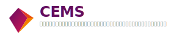

# 🎓 CEMS: Club & Event Management System in University

<div align="center">



**ระบบจัดการชมรมและกิจกรรมภายในมหาวิทยาลัย**

[](LICENSE)
[](https://golang.org)
[](https://reactjs.org)
[](https://www.typescriptlang.org)

</div>

---

## 📋 ข้อมูลโครงงาน

| รายละเอียด | ข้อมูล |
|------------|--------|
| **รหัสโครงงาน** | CPE-681017 |
| **ภาคการศึกษา** | 1/2568 |
| **สาขาวิชา** | วิศวกรรมคอมพิวเตอร์ |
| **สำนักวิชา** | วิศวกรรมศาสตร์ มหาวิทยาลัยเทคโนโลยีสุรนารี |

---

## 🌟 ภาพรวมโครงงาน

> **CEMS** เป็นแพลตฟอร์มแบบครบวงจรสำหรับการจัดการชมรมและกิจกรรมนักศึกษา ที่ออกแบบมาเพื่อเชื่อมโยงนักศึกษา ชมรม และผู้ดูแลระบบเข้าด้วยกันอย่างมีประสิทธิภาพ

### 🎯 ปัญหาที่เราจะแก้ไข

<table>
<tr>
<td align="center" width="25%">
<strong>การประชาสัมพันธ์กระจัดกระจาย</strong><br>
<small>ข่าวสารกิจกรรมไม่มีจุดรวม</small>
</td>
<td align="center" width="25%">
<strong>การสมัครกิจกรรมซับซ้อน</strong><br>
<small>ต้องใช้ Google Form หลายแบบ</small>
</td>
<td align="center" width="25%">
<strong>การบันทึกชั่วโมงด้วยตนเอง</strong><br>
<small>ไม่มีระบบติดตามอัตโนมัติ</small>
</td>
<td align="center" width="25%">
<strong>การจัดการชมรมยุ่งยาก</strong><br>
<small>ขาดเครื่องมือจัดการสมาชิก</small>
</td>
</tr>
</table>

---

## ✨ ฟีเจอร์หลัก

### 🎓 สำหรับนักศึกษา
- 🔍 **ค้นหากิจกรรม** - ค้นหาและกรองกิจกรรมตามความสนใจ
- 📝 **สมัครออนไลน์** - สมัครเข้าร่วมกิจกรรมได้ทันที
- ⏰ **ติดตามชั่วโมง** - ตรวจสอบชั่วโมงกิจกรรมสะสม
- 🔔 **รับการแจ้งเตือน** - ข่าวสารจากชมรมที่สนใจ
- 💡 **เสนอชมรมใหม่** - สร้างและเสนอก่อตั้งชมรม

### 🏛️ สำหรับชมรม
- 📅 **จัดการกิจกรรม** - สร้าง แก้ไข และจัดการกิจกรรม
- 👥 **บริหารสมาชิก** - อนุมัติและจัดการสมาชิกชมรม
- 📢 **ประชาสัมพันธ์** - โพสต์ข่าวสารและอัปเดต
- 📸 **แชร์สื่อ** - อัปโหลดรูปภาพและวิดีโอกิจกรรม
- 📊 **รายงานสถิติ** - ติดตามสถิติการเข้าร่วมของสมาชิก

### 🛠️ สำหรับผู้ดูแลระบบ
- 🎛️ **ควบคุมระบบ** - จัดการภาพรวมของแพลตฟอร์ม
- 🔐 **จัดการสิทธิ์** - กำหนดบทบาทและสิทธิ์ผู้ใช้
- 📈 **วิเคราะห์ข้อมูล** - สรุปรายงานและสถิติกิจกรรม
- ✅ **อนุมัติกิจกรรม** - ตรวจสอบและอนุมัติชมรมและกิจกรรม

---

## 🛠️ เทคโนโลยีที่ใช้

<div align="center">

### Frontend


### Backend


### DevOps & Tools


</div>

---

### 🎯 ระบบหลัก

<div align="center">

| ระบบหลัก | สถานะ | รายละเอียด |
|---------|-------|------------|
| 📅 **ระบบจัดการกิจกรรม** | ✅ | สร้าง แก้ไข และจัดการกิจกรรมทุกประเภท |
| 📝 **ระบบสมัครเข้าร่วมกิจกรรมออนไลน์** | ✅ | ลงทะเบียนออนไลน์พร้อมจำกัดจำนวนผู้เข้าร่วม |
| 🏛️ **ระบบจัดการชมรม** | ✅ | บริหารจัดการชมรมและองค์กรนักศึกษา |
| 🔔 **ระบบแจ้งเตือนและติดตามข่าวสารกิจกรรม** | ✅ | แจ้งเตือนผ่าน Email, Web และ Real-time |
| 👤 **ระบบจัดการข้อมูลส่วนตัว** | ✅ | จัดการโปรไฟล์และข้อมูลส่วนบุคคล |
| 📸 **ระบบแชร์ภาพ/วิดีโอจากกิจกรรม** | ✅ | อัปโหลดและแชร์สื่อภาพจากกิจกรรม |
| 📊 **ระบบรายงานผลและการวิเคราะห์กิจกรรม** | ✅ | สร้างรายงาน PDF/Excel และแดชบอร์ดสถิติ |
| 🛡️ **ระบบจัดการสิทธิและยืนยันตัวตน** | ✅ | ระบบ RBAC และ OAuth2 Authentication |

</div>

### 📚 ACM CCS Classification
- **Information systems** → Web applications
- **Software and its engineering** → Software organization and properties  
- **Human-centered computing** → Collaborative and social computing systems and tools

---

## 🎯 ประโยชน์ที่คาดว่าจะได้รับ

<table>
<tr>
<td align="center" width="20%">
<br>
<strong>นักศึกษา</strong><br>
<small>ค้นหาและเข้าร่วมกิจกรรม<br>ได้อย่างสะดวกรวดเร็ว</small>
</td>
<td align="center" width="20%">
<br>
<strong>ชมรม</strong><br>
<small>จัดการกิจกรรมและสมาชิก<br>ได้อย่างเป็นระบบ</small>
</td>
<td align="center" width="20%">
<br>
<strong>มหาวิทยาลัย</strong><br>
<small>ติดตามและวิเคราะห์ข้อมูล<br>เพื่อพัฒนานโยบาย</small>
</td>
<td align="center" width="20%">
<br>
<strong>การสื่อสาร</strong><br>
<small>ลดช่องว่างการสื่อสาร<br>ระหว่างหน่วยงาน</small>
</td>
<td align="center" width="20%">
<br>
<strong>ขยายผล</strong><br>
<small>นำไปประยุกต์ใช้<br>ในมหาวิทยาลัยอื่น</small>
</td>
</tr>
</table>

---

## 🚀 การเริ่มต้นใช้งาน

### ⚡ ข้อกำหนดเบื้องต้น

```bash
Node.js >= 18.0.0
Go >= 1.21.0
Docker (ไม่บังคับ)
Git
```

### 📦 การติดตั้ง

1. **โคลนโปรเจค**
```bash
git clone https://github.com/your-team/cems.git
cd cems
```

2. **ติดตั้ง Frontend**
```bash
cd frontend
npm install
npm run dev
```

3. **ติดตั้ง Backend**
```bash
cd backend
go mod tidy
go run main.go
```

4. **ใช้งานผ่าน Docker** (แนะนำ)
```bash
docker-compose up -d
```

### 🌐 เข้าถึงระบบ

- **Frontend**: http://localhost:5173
- **Backend API**: http://localhost:8000

### 👤 ข้อมูลทดสอบ

```
Admin: admin@sut.ac.th / admin123
Student: student001@sut.ac.th / student123
Club Manager: club.admin001@sut.ac.th / clubadmin123
```

---

## 📞 Contact

<div align="center">

| สมาชิก | อีเมล | GitHub |
|--------|-------|--------|
| 👨‍💻 **พีรวิชญ์ ปัญญาโน** | B6512071@g.sut.ac.th | [@peerwich](https://github.com/peerwich) |
| 👨‍💻 **มาติน พานเชียงศรี** | B6525279@g.sut.ac.th | [@martin-p](https://github.com/martin-p) |
| 👨‍💻 **ไชยโรจน์ สดไธสงค์** | B6526320@g.sut.ac.th | [@chairoj](https://github.com/chairoj) |
| 👩‍💻 **จุฬารัตน์ เพียงไธสง** | B6527716@g.sut.ac.th | [@jularat](https://github.com/jularat) |

</div>

---

## 📄 License

โครงงานนี้พัฒนาขึ้นเพื่อการศึกษาในรายวิชา Computer Engineering Capstone Project  
สาขาวิชาวิศวกรรมคอมพิวเตอร์ มหาวิทยาลัยเทคโนโลยีสุรนารี

**© 2025 CEMS Development Team - All Rights Reserved**

---

## 🔗 ลิงก์ที่เป็นประโยชน์

### 🎨 ไอคอนและรูปภาพ
- **Icons8**: https://icons8.com/icons - ไอคอนฟรีคุณภาพสูง
- **Unsplash**: https://unsplash.com/s/photos/students - รูปถ่ายนักศึกษาฟรี
- **Pexels**: https://www.pexels.com/search/university/ - รูปภาพมหาวิทยาลัยฟรี
- **Flaticon**: https://www.flaticon.com/free-icons/student - ไอคอนนักศึกษา

### 🛠️ เครื่องมือพัฒนา
- **React Documentation**: https://react.dev/
- **Go Documentation**: https://golang.org/doc/
- **Tailwind CSS**: https://tailwindcss.com/docs
